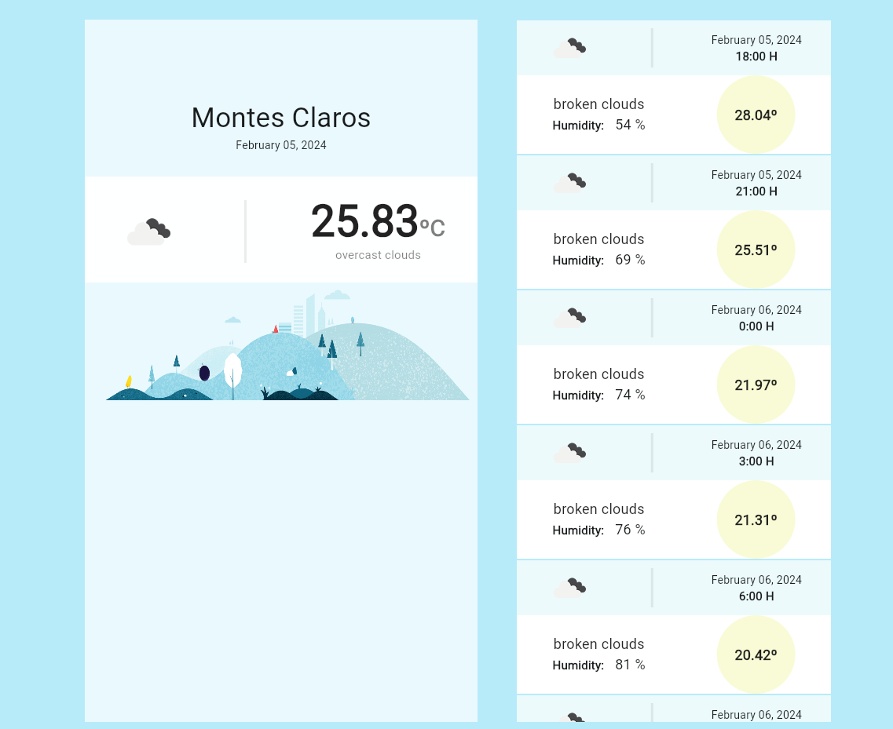

# weather

## Login
test@email.com -> any with @\
Test123 -> any with one Uppercase letter, a number and length >5 .

## My SetUp
Doctor summary (to see all details, run flutter doctor -v):\
[√] Flutter (Channel stable, 3.16.9, on Microsoft Windows [Version 10.0.22621.3007], locale en-GB)\
[√] Windows Version (Installed version of Windows is version 10 or higher)\
[√] Android toolchain - develop for Android devices (Android SDK version 33.0.0)\
[√] Chrome - develop for the web\
[√] Visual Studio - develop Windows apps (Visual Studio Community 2022 17.2.3)\
[√] Android Studio (version 2022.1)\
[√] VS Code (version 1.86.0)\
[√] Connected device (4 available)\
[√] Network resources

## Arch
Skipped Entities\
treated Datasource as Repository.

## Tests
Feature weather has some.
### Coverage
weather feature -> 69,9%

## Screens

### Web

### Mobile
